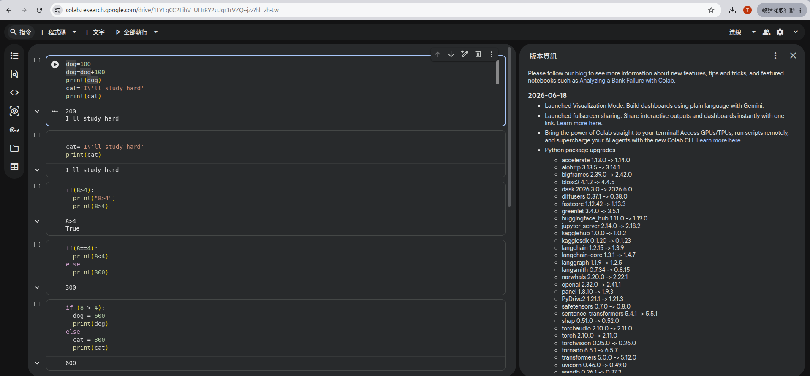

## 【人工智慧工具應用實務班第01期】- 115年06月25日
## （10:00 ~ 12:00）資訊與通訊技術（徐偉智）
### ** Information 的核心是 Coding computational thinking : How Computer Think ?
### ** [Colab](https://colab.research.google.com/) , 開啟新筆記本

### ** Coding 七大要素 , Coding Language. 有 syntax (語法)
#### 1. Variable (變數) , 就是儲存資料盒子 , 通常有名字 , 盒子的儲存空見識來自 Memory .
```python
dog = 100       # 將 = 右邊的 100 放到左邊的 Box
dog = dog + 100 # 如果變數名稱出現在 = 的右邊 , 就是把 content 取出
                # 在 = 右邊一定先運算 , 結果再放到左邊的 Box
print(dog)      # 小括號內一定先運算 , 如果變數出現再小括號內 , 也是 take content out .
```
#### 2. operator (運算子)
 ```+``` , ```-``` , ```*``` , ```/``` , ```%```<br>
 ```加``` , ```減``` , ```乘``` , ```除``` , ```取餘數``` => 算術運算子 ```(Arithmetic Operator)```<br>

#### 3. function (功能函數 , 簡稱函數 , 函式 , 方法 , 操作)
 打包某一種功能使成一個單元 ```(unit)``` , 可以直接呼叫使用 .<br>
 ```Python``` 有許多內建的 ```function``` ```(Built-in)``` , 如：```print(...)``` 會將 ```...``` 顯示在 ```console (控制台)``` 畫面上 .<br>

#### 4. Data Type (資料型態)
 (1) ```integer``` (整數) ```234```, ```567```, ```-987```<br>
 (2) ```float``` ( 浮點數) ```-90.87```, ```100.25```<br>
 (3) ```string``` (字串) ```"I am happy!"``` ， ```'I\'ll study hard.'```<br>
 -- ```escape character``` (跳脫字元)將字元的特殊意義去掉<br>
 -- 例如 ```'``` 有特殊意義，是要包起字串的，但 ```\'``` 會讓Python將它當做純字元<br>

#### 5. decision (決策)， if-then-else 就是智慧
```python
if (8 > 4):
 print("8 > 4")
```
 -- ```relation operator``` (關係運算子)，比較大小<br>
 (1) ```>``` 是否大於<br>
 (2) ```<``` 是否小於 <br>
 (3) ```==``` 是否等於<br>
 -- ```relation operating``` 的結果不是 ```True``` 就是  ```False```<br>
 -- ```{True, False}``` 是一種 ```Data Type```，叫 ```Boolean Value``` (布林值)<br>
 -- ```if``` 的 ```()``` 內的條件為 ```True``` 才會執行:下的 ```Block``` 之代碼<br>
 *** ```Python``` 的 ```code block``` 內縮排要一致，而且至少要比上一接縮排一個空白<br>
 -- 不要用 ```tab``` 鍵做縮排<br>
```python
if (8 > 4):
  dog=600
  print(dog)
else:
 cat=300
 print(cat)
```
#### 6. loop 迴圈，有 for loop 與  while loop
 -- 寫一個程式可以從 ```1``` 累加到 ```5```<br>
```python
total=0
total=total+1
total=total+2
total=total+3
total=total+4
total=total+5
print(total)
```
 -- ```for loop``` 重複相同樣式若干次<br>
```python
total=0 #給初始值
for n in range(1,6):
  total=total+n
print(total)
```
#### 7. ```Data Structure``` 資料結構，將多個資料以某種結構存起來，陣列 ```(array)``` 是最簡單的線性結構
 -- 陣列是櫃子，編號從 ```0``` 開始<br>
```python
city=["Taipei", "Tainan", "Kaoshoung"] #將城市名存在array city中
print(city[0]) #Taipei
````
<br>

## （13:00 ~ 17:00）工作自動化流程（趙伯元）
#### [課程講義](PPT/n8n實戰1-從思維轉型到實作分析的全維度指南.pdf)