## 【人工智慧工具應用實務班第01期】- 115年06月29日
## （08:00 ~ 12:00）Python程式設計實務（張剛鳴）
### 1. [python 入門](https://www.w3schools.com/python/python_getstarted.asp)
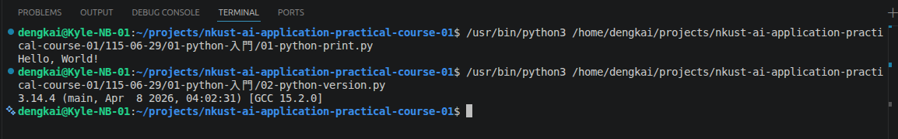
### 2. [python 語法](https://www.w3schools.com/python/python_syntax.asp)
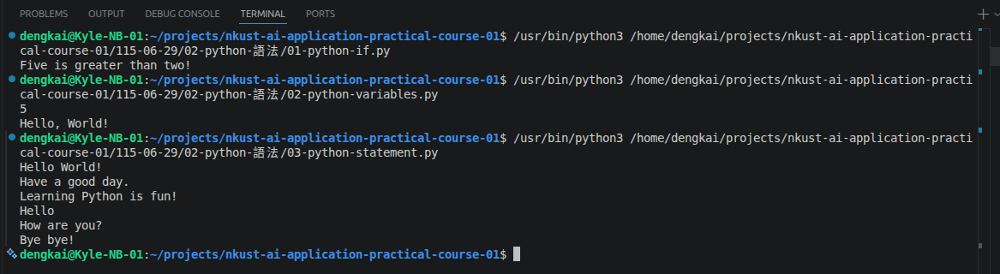
### 3. [python 輸出列印](https://www.w3schools.com/python/python_output.asp)
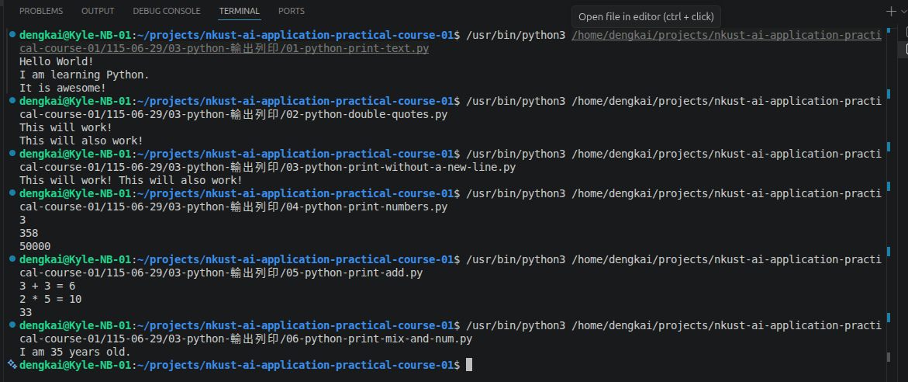
### 4. [python 註解](http://w3schools.com/python/python_variables.asp)
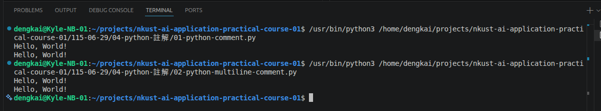
### 5. [python 變數](https://www.w3schools.com/python/python_variables.asp)
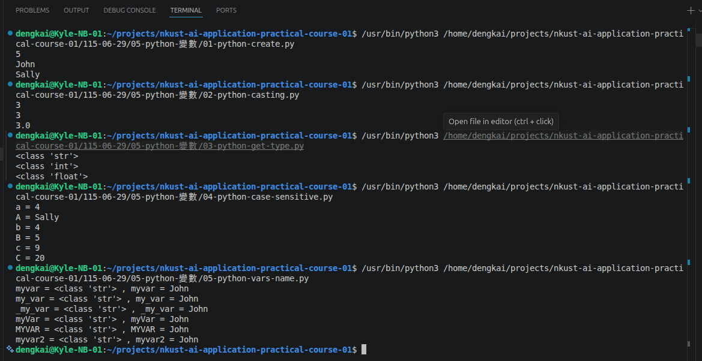
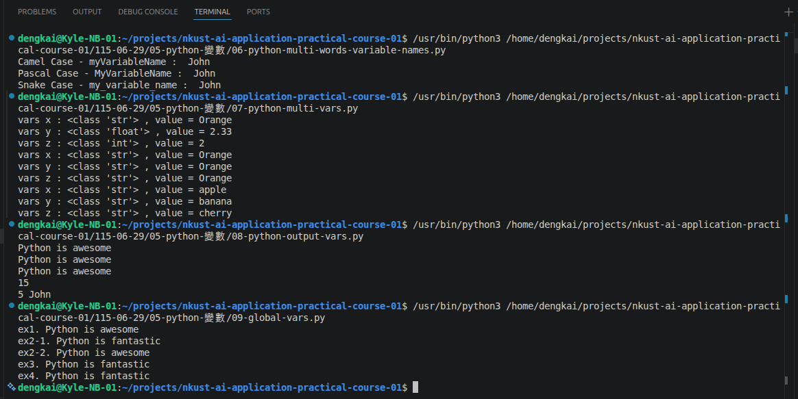
### 6. [python 資料型態](https://www.w3schools.com/python/python_datatypes.asp)
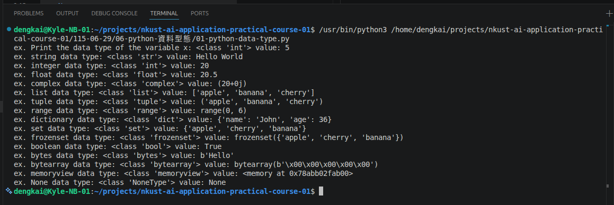
### 7. [python number](https://www.w3schools.com/python/python_numbers.asp)
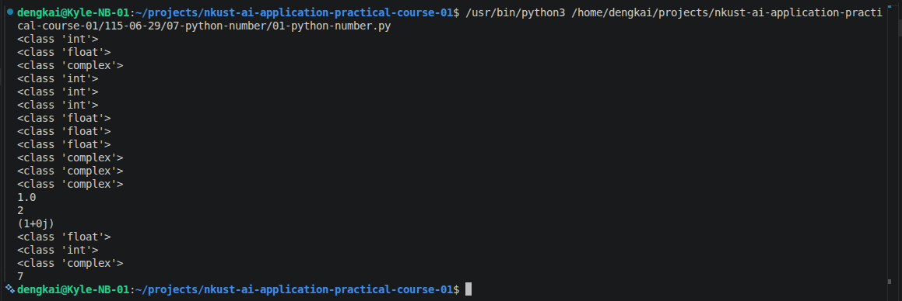
## （13:00 ~ 17:00）Python程式設計實務（張剛鳴）
### 8. [python 類型轉換](https://www.w3schools.com/python/python_casting.asp)
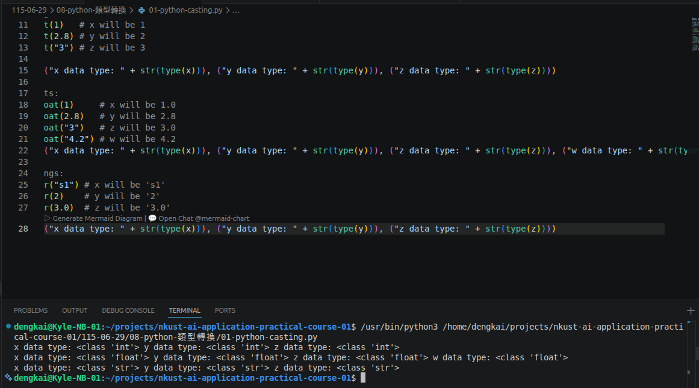
### 9. [python 字串](https://www.w3schools.com/python/python_strings.asp)
#### 9-1. [Python Strings](https://www.w3schools.com/python/python_strings.asp)
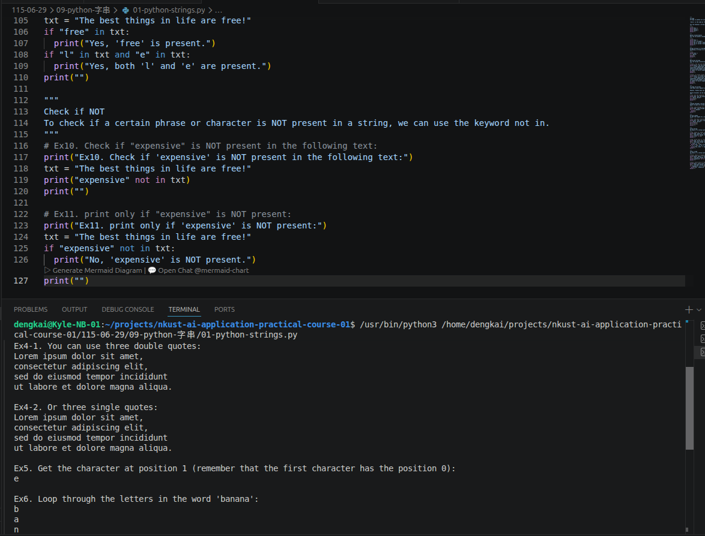
#### 9-2. [Python - Slicing Strings](https://www.w3schools.com/python/python_strings_slicing.asp)
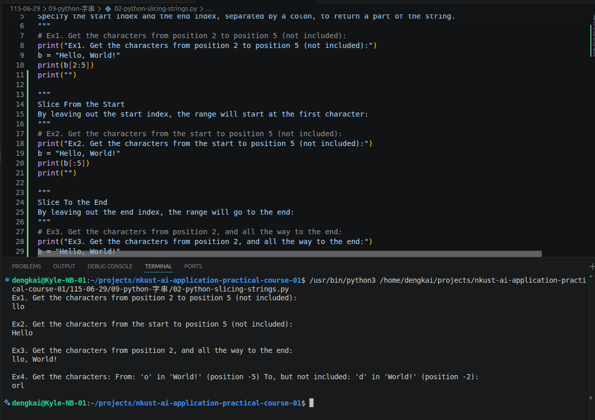
#### 9-3. [Python - Modify Strings](https://www.w3schools.com/python/python_strings_modify.asp)
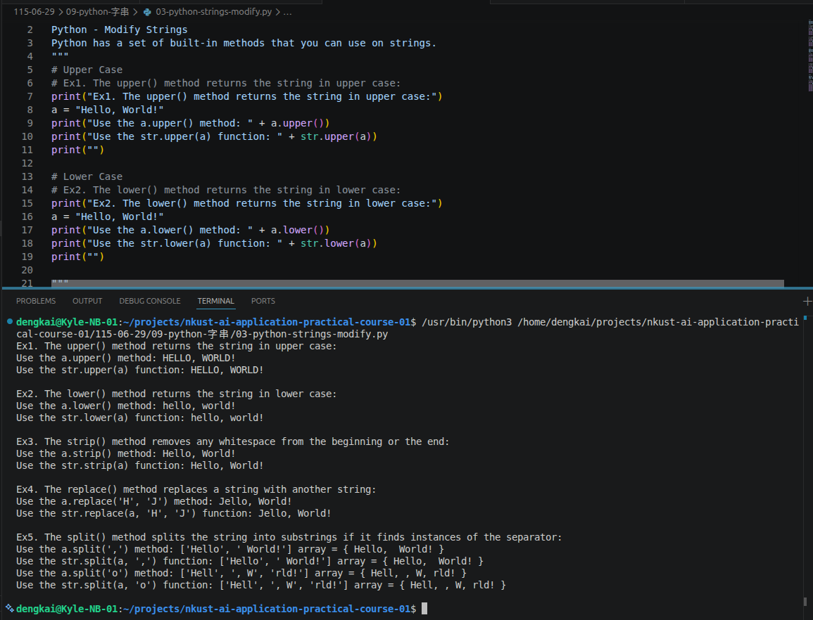
#### 9-4. [Python - String Concatenation](https://www.w3schools.com/python/python_strings_concatenate.asp)
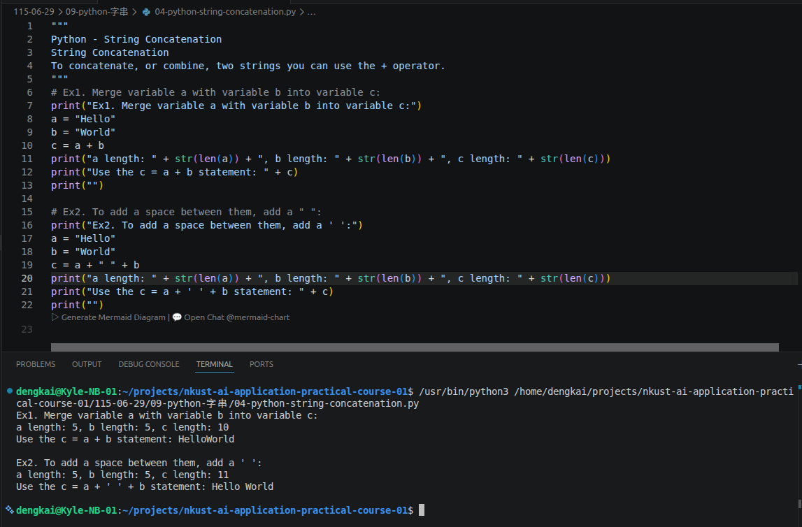
#### 9-5. [Python - Format - Strings](https://www.w3schools.com/python/python_strings_format.asp)
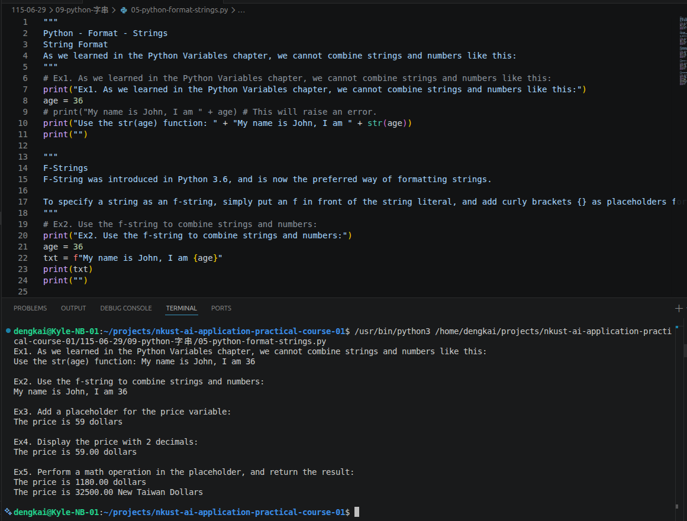
#### 9-6. [Python - Escape Characters](https://www.w3schools.com/python/python_strings_escape.asp)
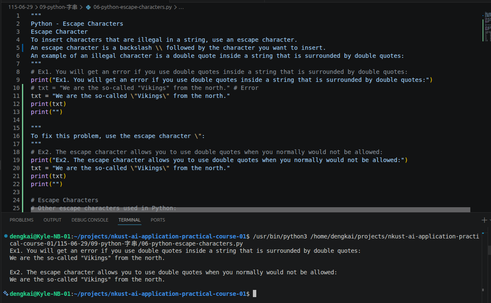
#### 9-7. [Python - String Methods](https://www.w3schools.com/python/python_strings_methods.asp) 
[Python - String Methods](07-python-string-methods.md)
#### 9-8. [Python - Booleans](https://www.w3schools.com/python/python_booleans.asp)
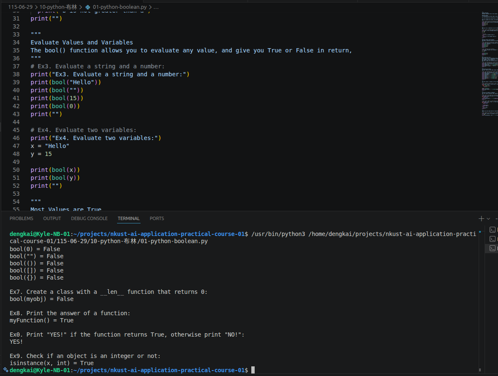