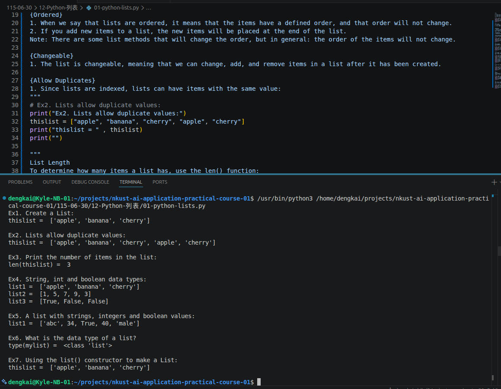
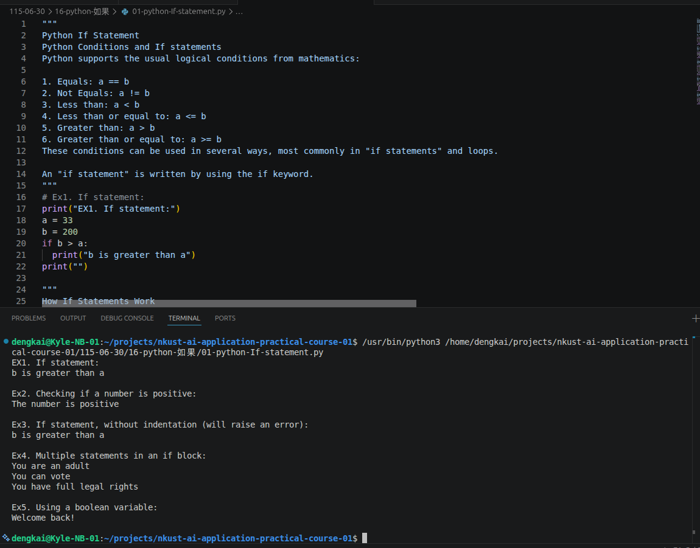
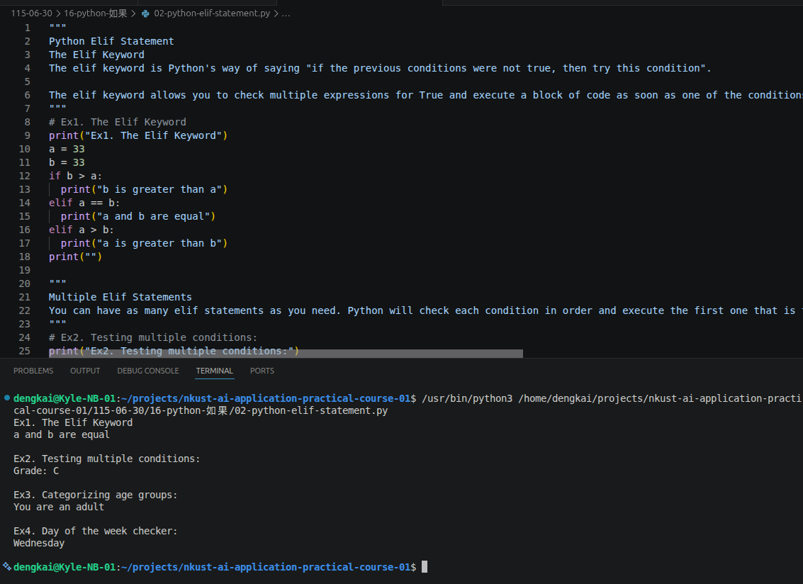
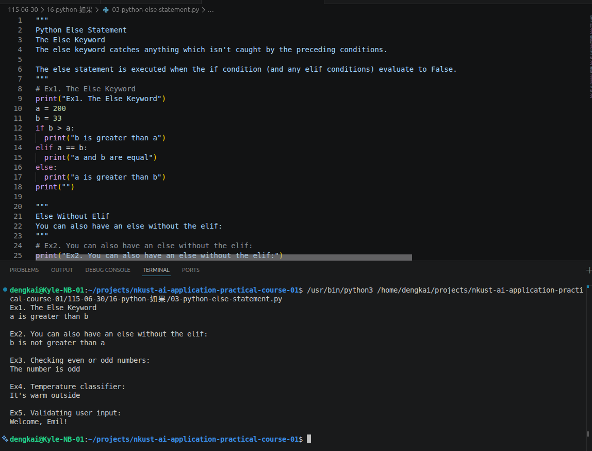
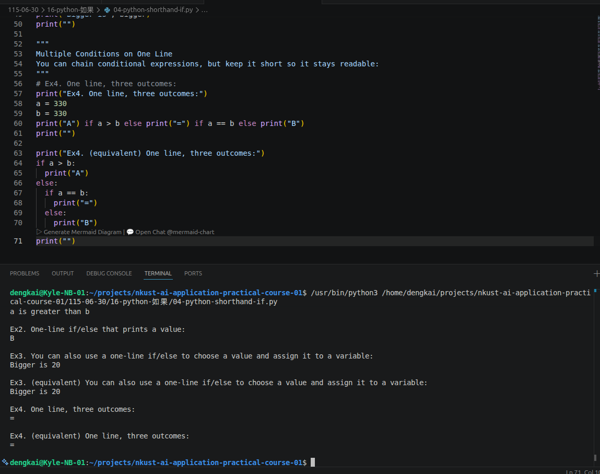
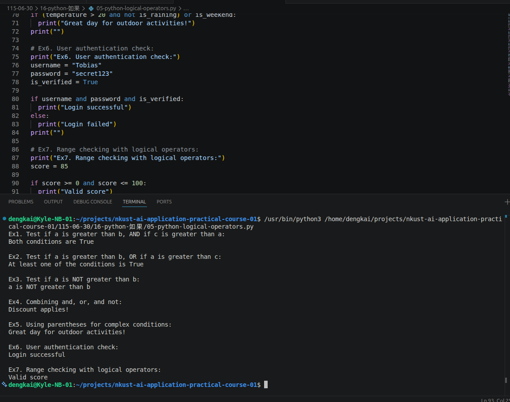
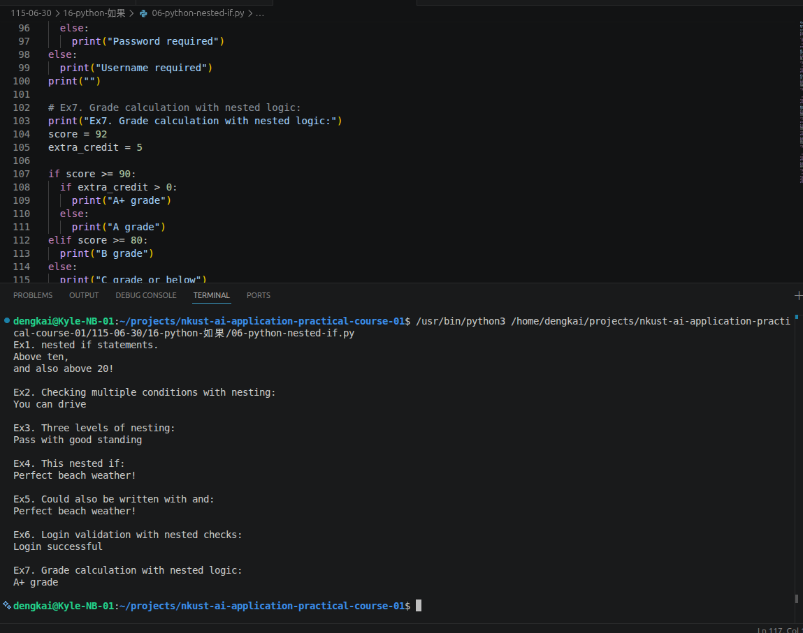
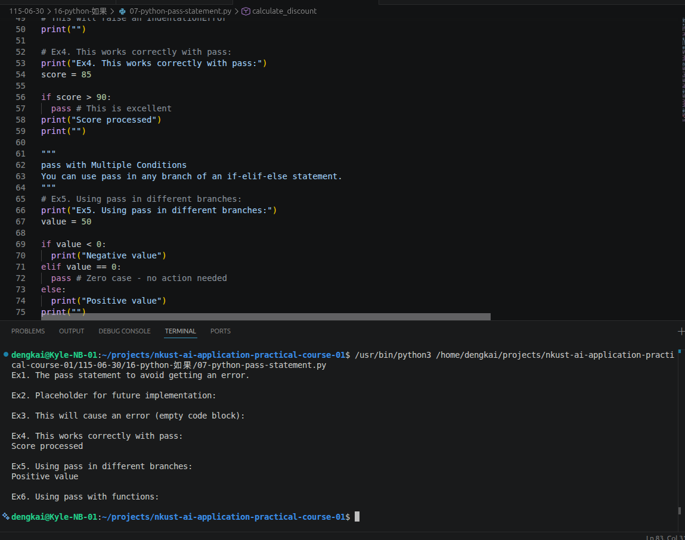

## 【人工智慧工具應用實務班第01期】- 115年06月30日
## （08:00 ~ 12:00）Python程式設計實務（張剛鳴）
### 12. [Python 列表](https://www.w3schools.com/python/python_lists.asp)

#### 12-1. [Python - Access List Items](https://www.w3schools.com/python/python_lists_access.asp)
#### 12-2. [Python - Change List Items](https://www.w3schools.com/python/python_lists_change.asp)
#### 12-3. [Python - Add List Items](https://www.w3schools.com/python/python_lists_add.asp)
#### 12-4. [Python - Remove List Items](https://www.w3schools.com/python/python_lists_remove.asp)
#### 12-5. [Python - Loop Lists](https://www.w3schools.com/python/python_lists_loop.asp)
#### 12-6. [Python - List Comprehension](https://www.w3schools.com/python/python_lists_comprehension.asp)
#### 12-7. [Python - Sort Lists](https://www.w3schools.com/python/python_lists_sort.asp)
#### 12-8. [Python - Copy Lists](https://www.w3schools.com/python/python_lists_copy.asp)
#### 12-9. [Python - Join Lists](https://www.w3schools.com/python/python_lists_join.asp)
#### 12-10. [Python - List Methods](https://www.w3schools.com/python/python_lists_methods.asp)
### 13. [Python - Tuples](https://www.w3schools.com/python/python_tuples.asp)

### 16. [python 如果](https://www.w3schools.com/python/python_conditions.asp)

#### 16-1. [Python - Elif Statement](https://www.w3schools.com/python/python_if_elif.asp)

#### 16-2. [Python - Else Statement](https://www.w3schools.com/python/python_if_else.asp)

#### 16-3. [Python - Shorthand If](https://www.w3schools.com/python/python_if_shorthand.asp)

#### 16-4. [Python - Logical Operators](https://www.w3schools.com/python/python_if_logical.asp)

#### 16-5. [Python - Nested If](https://www.w3schools.com/python/python_if_nested_if.asp)

#### 16-6. [Python - Pass Statement](https://www.w3schools.com/python/python_if_pass.asp)

## （13:00 ~ 17:00）Python程式設計實務（張剛鳴）
### 1.
### 2.
### 3.