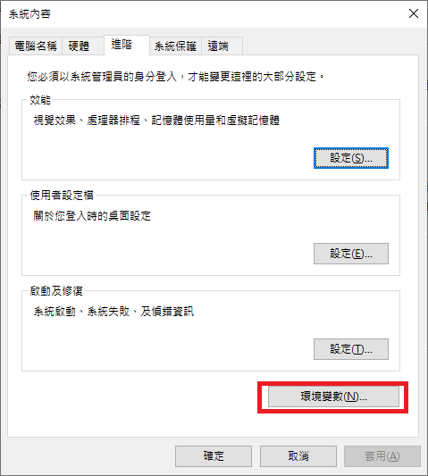
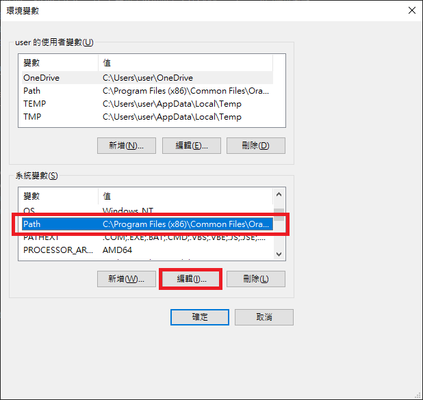
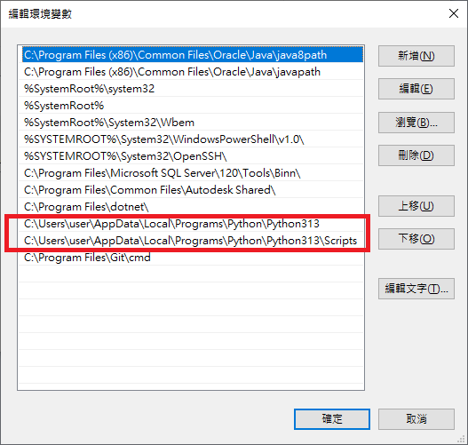

## 【人工智慧工具應用實務班第01期】- 115年07月01日
## （08:00 ~ 12:00）Python Flask 框架（徐偉智）
### 基本設定
#### 1. windows 設定環境變數
(1) ```[控制台]``` --> ```[系統]``` --> ```[進階系統設定]```<br>




(2) 加入 ```C:\Users\user\AppData\Local\Programs\Python\Python313``` 與 ```C:\Users\user\AppData\Local\Programs\Python\Python313\Scripts``` python bin 路徑<br>


#### 2. git 設定
```sh
git config --global user.name "username"
git config --global user.email "usernameg@gmail.com"
git config --local user.name "username"
git config --local user.email "username@gmail.com"
```
#### 3. 安裝 python module
```sh
# 安裝 NumPy module
pip install numpy

# 安裝 Flask 函式庫
pip install flask

# 安裝 Django 函式庫
pip install flask
```
### 
## （13:00 ~ 17:00）Python Flask 框架（徐偉智）
### Prompt
#### demofile 計算 Prompt
```prompt
有一個純文字檔，demofile.txt 有以下的 csv 格式，第一行紀錄的是欄位名稱，其他行紀錄的是 ID, name, 與 spend。
{ID,name,spend}, {1,Apartment Rent,1500.00}, {2,Corner Mart Grocers,45.25}
編寫一個 Python 程式。具有<spec>的功能。
<spec>
1. 將 demofile.txt 的每一行讀進一個陣列的一個元素。
2. 針對陣列，除了第一個元素的其他每一個元素，取出 spend 的值，加總起來，除以總筆數，算出平均數。
3. 印出 spend 的平均數，總數，以及總筆數。
</spec>
```
### 
### 