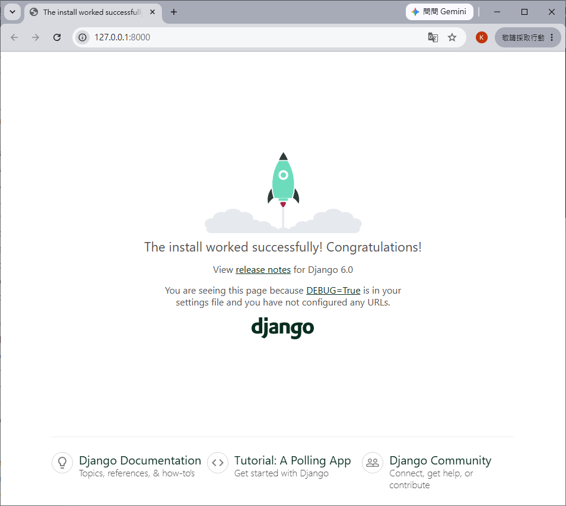

### My First Project
Once you have come up with a suitable name for your Django project, like mine: ```my_tennis_club```, navigate to where in the file system you want to store the code (in the virtual environment), I will navigate to the ```myworld``` folder, and run this command in the command prompt:
```sh
django-admin startproject my_tennis_club
```

Django creates a my_tennis_club folder on my computer, with this content:

```
my_tennis_club
    manage.py
    my_tennis_club/
        __init__.py
        asgi.py
        settings.py
        urls.py
        wsgi.py
```

These are all files and folders with a specific meaning, you will learn about some of them later in this tutorial, but for now, it is more important to know that this is the location of your project, and that you can start building applications in it.

### Run the Django Project
Now that you have a Django project, you can run it, and see what it looks like in a browser.

Navigate to the ```/my_tennis_club folder``` and execute this command in the command prompt:

```sh
python manage.py runserver
```

Which will produce this result:
```sh
Watching for file changes with StatReloader
Performing system checks...

System check identified no issues (0 silenced).

PS C:\Users\Public\kyle\nkust-ai-application-practical-course-01\115-07-01\my_tennis_club> python manage.py runserver
Watching for file changes with StatReloader
Performing system checks...

System check identified no issues (0 silenced).

You have 18 unapplied migration(s). Your project may not work properly until you apply the migrations for app(s): admin, auth, contenttypes, sessions.
Run 'python manage.py migrate' to apply them.
July 01, 2026 - 16:53:35
Django version 6.0.6, using settings 'my_tennis_club.settings'
Starting development server at http://127.0.0.1:8000/
Quit the server with CTRL-BREAK.

WARNING: This is a development server. Do not use it in a production setting. Use a production WSGI or ASGI server instead.
For more information on production servers see: https://docs.djangoproject.com/en/6.0/howto/deployment/
```
Open a new browser window and type 127.0.0.1:8000 in the address bar.

The result:



