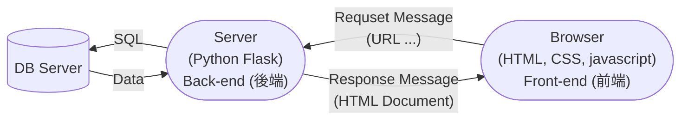
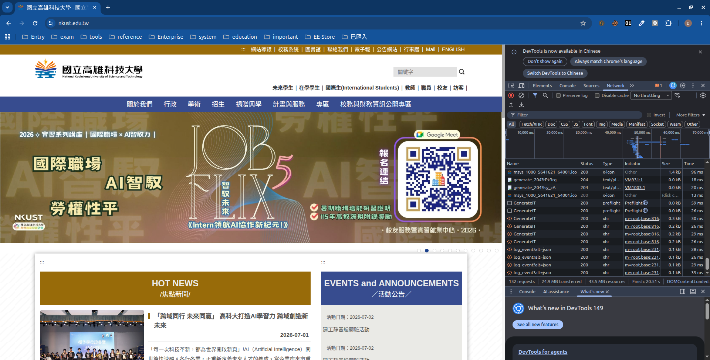

## 【人工智慧工具應用實務班第01期】- 115年07月02日
## （08:00 ~ 12:00）AI 代理人概論（曾士桓）
 - [課程講義 - AI 代理基礎與進階](https://drive.google.com/file/d/1hSnCcABP8LZe8I_KI3HCchaexdvRqIek/view?usp=drive_link)
 - [2026 年 AI 生產力工具與 Agent 平台全解析](https://drive.google.com/file/d/1PamgL0_wLL8Ty5_boRytCyX9yc51tIaV/view?usp=drive_link)
### 
### 
### 
## （13:00 ~ 17:00）檢索增強生成應用系統開發（徐偉智）
### Web Application（網站應用程式）
 - ASP.NET + MSSQL Server + IIS
 - PHP + MySQL + Apache Server
 - Java Servlet + JSP + PostgreSQL + Tomcat Server
 - <span style="color:red">Python + MySQL + Flask</span>


 - 每一次 Browseer 從 Web Server 下載 resource （.html、.css、.js、 ...）都是一次的 Request 與 Response<br><br>
### 系統環境變數 PATH 加入
 - <span style="color:red">C:\Users\user\AppData\Local\Programs\Python\Python313</span><br>
 - <span style="color:red">C:\Users\user\AppData\Local\Programs\Python\Python313\Scripts</span>
### Prompt
```prompt
編寫一個 Python Flask Web Application 的最簡單學習範例，規格如<spec>所述。
<spec>
1. 不要使用動態網頁。
</spec>
```
### Python Flask 線上學習教材
 - [https://ithelp.ithome.com.tw/users/20120116/ironman/2532](https://ithelp.ithome.com.tw/users/20120116/ironman/2532)
### 執行中的 Server 是不關機的
### Coding 工作很煩人
 - 
### Python Flask 是一 Web Application 開發框架（Framework）
 - Web Application 的執行環境都建好了。
 - 我們只要按照他的框架與規範，就可以開發 Web Application
 - 框架有很多種，即時 Python 
###  
```sh
proj001/
├── app.py
└── static/         # <-- 必須是這個名字
    └── index.html  # <-- 你的首頁檔案
``` 
#### 解釋 app.py
```python
from flask import Flask # 從 flask 集合體中載入 Flask 模組

# 建立 Flask 應用程式
app = Flask(__name__)

# 首頁：http://127.0.0.1:5000/ 瀏覽器輸入該網址，會觸發 (invoke) home() 函式的執行
@app.route('/')
def home():
    # static_folder 預設就是 'static'，直接指定檔案名稱即可
    return app.send_static_file('index.html') # 呼叫 app.send_static_file 函式將靜態 index.html 的內容傳送到 Browser

# 啟動 Flask
if __name__ == "__main__":
    app.run(debug=True)
```

### Browser 可以解讀 HTML 語法，然後呈現內容。

### HTML 語法
1. 是一種 tag 語法，tag 是成對的 ```<tag_name> ... </tag_name>```
2. 每一個 tag 對瀏覽器都有不同的意義，也就是瀏覽器看到一個 tag 就會有不同的作用或呈現的結果，舉例來說：
```html
-- 會有超連結的作用
<a href-"https:/wwww.nkust.edu.tw/">高科大</a>
```
3. 每一個 tag 都有參數 (argment) 可以設定，例如 ```<a href="...">```；``````
4. 如果 tag 沒有包含其他內容，則可以省略結束 tag ，例如： ```</img>``` 可以省略為 ``````，更精簡的寫法 `````` 。
5. tag 是巢狀包含的，例如：```<body><a></a></body>```。
6. HTML 要求沒有那麼嚴謹，只要有 tag 就 OK ，但正規的 HTML Document 應該要有如下的 tag
```html
<html>
    <head></head>
    <body>
        <!-- 在 body tag 內的 tags，就是會成現在 Browser 的窗格上的 --->
    </body>
</html>
```
 - 練習 index.html
 ```html
 <html>
    <head>
        <title>我的第一個 HTML</title>
    </head>
    <body>
        
        <a href="https://www.nkust.edu.tw/" target="_blank">高科大</a>
    </body>
</html>
 ```
 - ```<p>```：段落（會段三行），```<br>```：換行。
### Prompt
```prompt
不用 CSS，只用HTML，如何設定字的顏色與大小。
```
### HTML 主要是用來表現資訊內與結構，CSS 則用來作樣式修飾。
### Prompt
```prompt
編寫一個 Python Flask Web Application ，具有<spec>的規格。
<spec>
1. 我已編寫好 index.html 。使用 route / 可以連到 index.html。
2. index.html 有使用到 test.jpg
3. 使用靜態網頁呈現，不要使用動態網頁。
</spec>
```