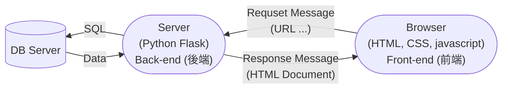

## 【人工智慧工具應用實務班第01期】- 115年07月02日
## （08:00 ~ 12:00）AI 代理人概論（曾士桓）
 - [課程講義 - AI 代理基礎與進階](https://drive.google.com/file/d/1hSnCcABP8LZe8I_KI3HCchaexdvRqIek/view?usp=drive_link)
 - [2026 年 AI 生產力工具與 Agent 平台全解析](https://drive.google.com/file/d/1PamgL0_wLL8Ty5_boRytCyX9yc51tIaV/view?usp=drive_link)
### 
### 
### 
## （13:00 ~ 17:00）檢索增強生成應用系統開發（徐偉智）
### Web Application（網站應用程式）
 - ASP.NET + MSSQL Server + IIS
 - PHP + MySQL + Apache Server
 - Java Servlet + JSP + PostgreSQL + Tomcat Server
 - <span style="color:red">Python + MySQL + Flask</span>


 - 每一次 Browseer 從 Web Server 下載 resource （.html、.css、.js、 ...）都是一次的 Request 與 Response<br><br>
### 系統環境變數 PATH 加入
 - <span style="color:red">C:\Users\user\AppData\Local\Programs\Python\Python313</span>， - <span style="color:red">C:\Users\user\AppData\Local\Programs\Python\Python313\Scripts</span>
### Prompt
```prompt
編寫一個 Python Flask Web Application 的最簡單學習範例，規格如<spec>所述。
<spec>
1. 不要使用動態網頁。
</spec>
```
### Python Flask 線上學習教材
 - [https://ithelp.ithome.com.tw/users/20120116/ironman/2532](https://ithelp.ithome.com.tw/users/20120116/ironman/2532)
### 執行中的 Server 是不關機的
### Coding 工作很煩人
 - 
### Python Flask 是一 Web Application 開發框架（Framework）
 - Web Application 的執行環境都建好了。
 - 我們只要按照他的框架與規範，就可以開發 Web Application
 - 框架有很多種，即時 Python 
###  
```sh
proj001/
├── app.py
└── static/         # <-- 必須是這個名字
    └── index.html  # <-- 你的首頁檔案
``` 
#### 解釋 app.py
```python
from flask import Flask # 從 flask 集合體中載入 Flask 模組

# 建立 Flask 應用程式
app = Flask(__name__)

# 首頁：http://127.0.0.1:5000/ 瀏覽器輸入該網址，會觸發 (invoke) home() 函式的執行
@app.route('/')
def home():
    # static_folder 預設就是 'static'，直接指定檔案名稱即可
    return app.send_static_file('index.html') # 呼叫 app.send_static_file 函式將靜態 index.html 的內容傳送到 Browser

# 啟動 Flask
if __name__ == "__main__":
    app.run(debug=True)
```

### Browser 可以解讀 HTML 語法，然後呈現內容。