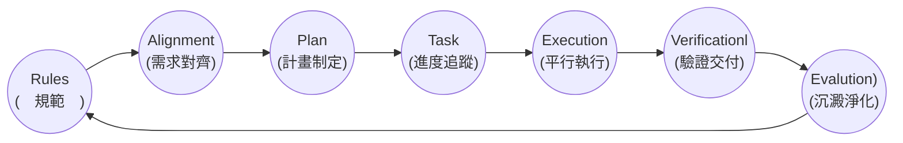

## 【人工智慧工具應用實務班第01期】- 115年07月06日
## （08:00 ~ 12:00）AI 代理人概論（曾士桓）
 - [AI 協作- Antigravity 2.0/Codex](https://drive.google.com/file/d/1zw4GLvG1Rmt9jB11mS6A_TtkjwR0KUQH/view?usp=drive_link)
 - [AI 協作 - 軟體開發生命週期](https://drive.google.com/file/d/1saDyqs06lJ6ARLe2fLid_wLbJjf5T61O/view?usp=drive_link)
### 
### 1. 開發思維的改變
 - 傳統開發模式
   - 手動編寫程式，花費大量時間在語法與 API 除錯上。
 - AI 協作開發模式
   - 工程師角色轉變為「**AI 專案經理與審查員**」
   - 專注於架構規劃、規則制定與成果驗證(Test & Verification)。
### 2. AI-assisted SLDC 藍團

#### 1. 定義規範(Rules)：AGENTS.md
#### 2. 需求對齊(Alignment)：互動問答收斂需求
#### 3. 計畫制定(Plan)：implementation_plan.md
#### 4. 進度追蹤(Task)：task.md
#### 5. 平行執行(Execution)：背景任務 & Subagents
#### 6. 驗證交付(Verificationl)：walkthrough.md
#### 7. 沉澱淨化(Evalution)：Custom Skill & /learn
### 
## （13:00 ~ 17:00）AI 代理人概論（曾士桓）
### 
### 
### 
