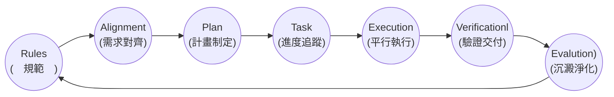

## 【人工智慧工具應用實務班第01期】- 115年07月06日
## （08:00 ~ 12:00）AI 代理人概論（曾士桓）
 - [AI 協作- Antigravity 2.0/Codex](https://drive.google.com/file/d/1zw4GLvG1Rmt9jB11mS6A_TtkjwR0KUQH/view?usp=drive_link)
 - [AI 協作 - 軟體開發生命週期](https://drive.google.com/file/d/1saDyqs06lJ6ARLe2fLid_wLbJjf5T61O/view?usp=drive_link)
### 
### 01-merge-files 任務與前置作業
[實作](https://github.com/dengkaitraining/google-ai-tools/tree/main/antigravity-2.0)
### 1. 開發思維的改變
 - 傳統開發模式
   - 手動編寫程式，花費大量時間在語法與 API 除錯上。
 - AI 協作開發模式
   - 工程師角色轉變為「**AI 專案經理與審查員**」
   - 專注於架構規劃、規則制定與成果驗證(Test & Verification)。
### 2. AI-assisted SLDC 藍團

#### 1. 定義規範(Rules)：<font color="red">AGENTS.md</font>
#### 2. 需求對齊(Alignment)：互動問答收斂需求
#### 3. 計畫制定(Plan)：<font color="red">implementation_plan.md</font>
#### 4. 進度追蹤(Task)：<font color="red">task.md</font>
#### 5. 平行執行(Execution)：背景任務 & Subagents
#### 6. 驗證交付(Verificationl)：<font color="red">walkthrough.md</font>
#### 7. 沉澱淨化(Evalution)：Custom Skill & <font color="red">/learn</font>
### 
## （13:00 ~ 17:00）AI 代理人概論（曾士桓）
### 3. 【實作一】Rules 制定專案鐵律
 - **全域與專案規則的分野**
   - **全域規則(Global Rules)**：存於個人設定，適用於所有專案。
   - **全域規則(Workspace Rules)**：存於專案目錄 ```.agents/AGENTS.md```，僅對此專案生效。
 - **專案區域規則實作**
 ```
  - 使用 Python 開發程式時，必須使用 `uv` 建立虛擬環境。
  - 嚴禁使用 base 環境或直接使用 pip，維持環境純淨。
 ```
 - Prompt 專案預設語言為「繁體中文」。
 ```
 我想在此專案建立 Workspace rules:
 1. 預設語言為繁體中文。
 ```
 - Prompt 增加其他規則。
 ```
 @rule:
 1. 使用 Python 開發程式時，必須使用 `uv` 建立虛擬環境。
 2. 嚴禁使用 base 環境或直接使用 pip，維持環境純淨。
 ```
 - Prompt 確認虛擬環境是否建立。
 ```
 您建立虛擬環境了嗎？
 ```
### 4. 【實作二】Requirement & Plan
 - **人機需求對齊(Alignment)**：
   - 寫 Code 前的關計步驟：釐清「使用者真正要什麼」（如使用 ```/grill-me``` 指令）
 - 計劃書（```implementation_plan.md```）三大核心：
   - **Open Questions**：向使用釐清並對齊模糊或未定義的需求。
   - **Proposed Changes**：條例預估異動的檔案與架構。
   - **Verification Plan**：明訂功能驗證方法。
### 5. 【實作三】Task Tracking 進度看板
 - 什麼是 Task Tracking？
   - 計畫被核准後，自動生成 ```task.md``` 任務清單。
 - 追蹤格式：
   - ```[ ]``` 未完成任務
   - ```[/]``` 正在進行中的任務（Progressing）
   - ```[x]``` 已完成並驗證的任務
### 6. 【實作四】Execution 背景執行與分工
 - 背景執行 (Backgroud Tasks)
   - 安裝套件、執行長測試時移至背景，不阻塞與 Agent 的對話。
 - 子代理人 (Sudagents)
   - 呼叫專職 Agent（如：```research```）平行搜尋論文或調用特定API。
### 7. 【實作五】Verification 嚴謹的驗證報告
 - 什麼是 Verification？
   - 