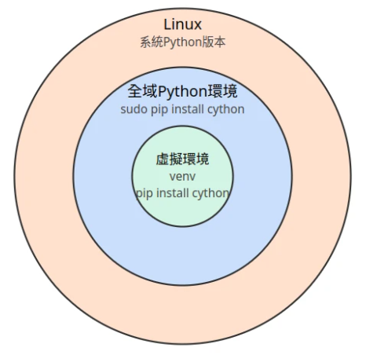

### Windows 使用 ```venv```
#### 1. ```Python``` 虛擬環境安裝 ```pip``` 套件 (建議方式)
 - 使用 [Python 官方文件](https://docs.python.org/3/library/venv.html)提及的虛擬環境 (virtual environment) 功能，也就是安裝 Python 套件前都先用 venv 建立一個虛擬環境，讓 Python 的套件跟 Linux 系統套件隔離，再於裡面使用 pip 安裝想要的套件。如此一來系統就不怕被 pip 弄壞，還可以防止不同專案的 Python 套件互相衝突。
 - Python 虛擬環境跟 pip 直接安裝套件到 Linux 系統有什麼差？請看下圖分解，以使用 cython 為例：如果你用 apt install 安裝 cython，屬於系統全域安裝，不論是哪一個使用者執行 Python 程式，都可以 import cython。但若是在 venv 虛擬環境裡面 pip install，就只有進入虛擬環境裡面才能 import cython。
 
 - 註：此處使用最簡單的Python venv建立虛擬環境，依賴Linux系統所安裝的Python，不能任意切換Python版本。若要切換多重Python版本，請裝其他 Python 環境管理工具，例如 [uv]() 、 [Conda]() 、 [Pipx]() 、 [Poetry]() 等等。
  - 1. 使用 **python -m venv** 指令，在家目錄建立一個叫做venv的虛擬環境，實際上就是一個新目錄：
  ```powershell
  cd ~ # project path
  python -m venv venv
  ```
  - 2. 然後用 ```PowerShell``` 指令，讀取venv目錄下的activate指令，進入虛擬環境，終端機的提示符前方應該會變成(venv)
  ```powershell
  Set-ExecutionPolicy -Scope Process -ExecutionPolicy Bypass
  .\venv\Scripts\Activate.ps1
  ```

  - 3. 然後就可以用 ```pip install``` 安裝套件了，如安裝 ```flask``` 套件。所有 ```pip install``` 安裝的套件都會跑到 ```venv``` 這個虛擬環境的目錄下。
  ```powershell
  # 安裝 flask 套件
  python -m pip install flask
  ```