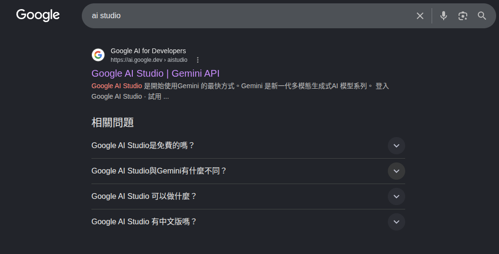
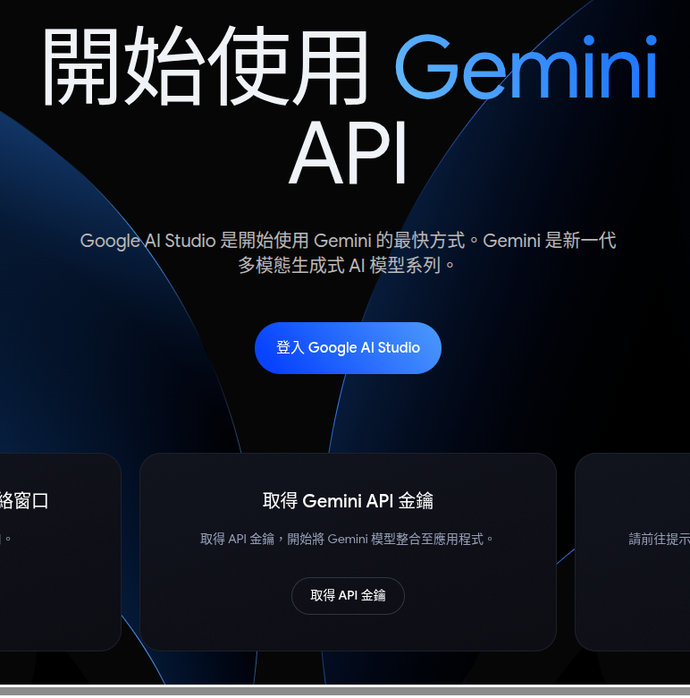
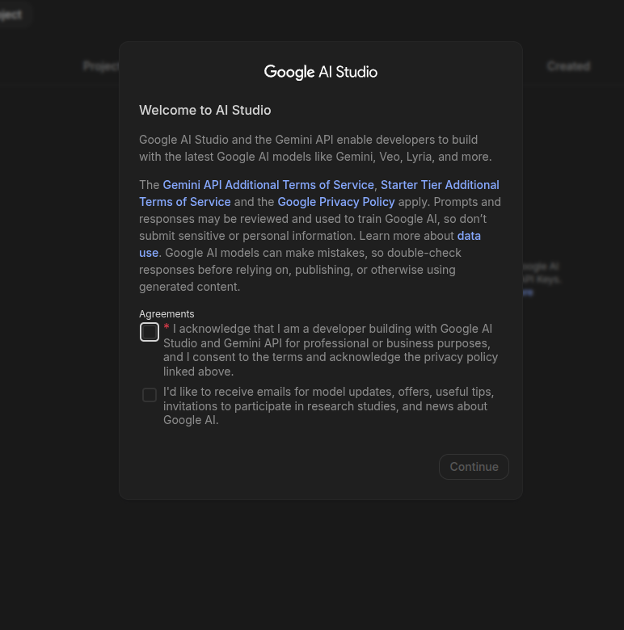
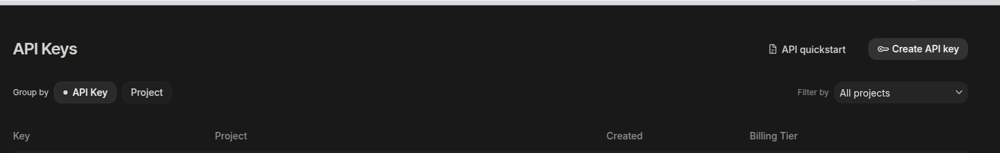
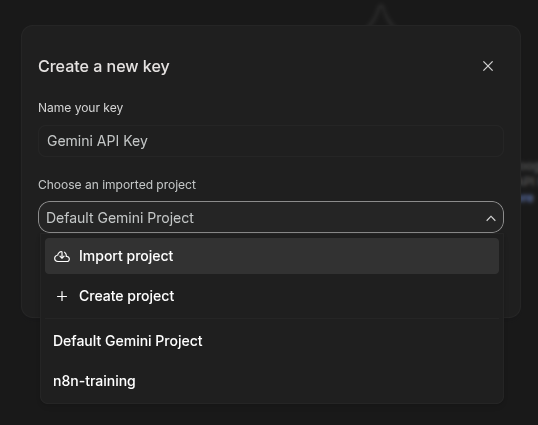
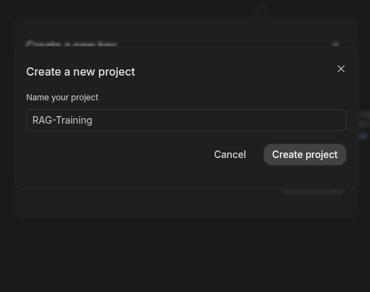

#### 1. 進入 AI Studio 取得 Google Gemini API 金鑰 [https://ai.google.dev/aistudio](https://ai.google.dev/aistudio)
 - (1) 進入網站 
 - (2) 取得 Google Gemini API 金鑰 
 - (3) 免責聲明 
#### 2. 建立專案項目
 - (1) 建立 API Key 
 - (2) 建立新專案 1 
 - (3) 建立新專案 2 
#### 3. 產生 API Key
