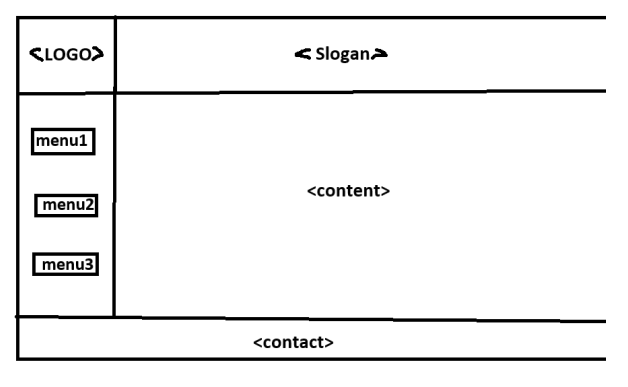

### ngrok server 是Proxy 代理我們在Local執行的Web Application , http://127.0.0.1:5000
1. 在cmd 或 Powershell 下
```winget install ngrok.ngrok``` 
安裝
2. ```ngrok config add-authtoken YOUR_AUTHTOKEN```
-- login 到ngrok 官方網站取得 YOUR_AUTHTOKEN
3. ```ngrok http 5000```  是將```Local Web Application``` , http://127.0.0.1:5000
成功後會看到類似:
Forwarding
https://breeches-fax-fruit.ngrok-free.dev -> http://localhost:5000
4.  https://breeches-fax-fruit.ngrok-free.dev  就是對外的```domain name```
### CSS 是前端樣式語法
-- Prompt
```xml
將<code>的 HTML代碼加上CSS語法，使有視覺美感。使用embedded方式，不必另存成.CSS檔。
<code>
 <!DOCTYPE html>
<html>
<head>
    <meta charset="UTF-8">
    <title>Flask Form Example</title>
</head>
<body>

    <h1>Flask Form 範例</h1>

    <form action="/process" method="POST">
        <label for="user_prompt">請輸入 User Prompt：</label>
        <input type="text" id="user_prompt" name="user_prompt">

        <button type="submit">送出</button>
    </form>

</body>
</html>
</code>
```
### CSS (Cascading Style Sheet)
 - 目的是修飾 HTML tag
 - 所謂修飾包含(1)顏色 (2)尺寸 (3)位置 (4)特效 (5)字型 (6)layout (佈局)
### CSS定義時，就要指定作用到哪一種或哪一個tag，後令壓前令
```css
body {
    margin: 0;
    min-height: 100vh;
    display: flex;
    justify-content: center;
    align-items: center;
    font-family: Arial, "Microsoft JhengHei", sans-serif;
    background: linear-gradient(135deg, #eaf2ff, #f7f9fc);
    color: #263238;
}
 h1 {
    margin-top: 0;
    margin-bottom: 12px;
    text-align: center;
    color: #1f4e79;
    font-size: 30px;
}
```
 - ```color: #1f4e79;``` 是 樣式名稱:設定值; 方便 ```Cascading```
### CSS 定義在哪裡? 有3種。
 1. ```embedding``` 方式，定義在```<style>``` 與 ```</style>```之間，而```<style>```與```</style>```必須包含在```<head>```與```</head>``` 之間
 2. ```inline``` 方式 ，比較少用
 ```html
 <h1 style="color:#00FF00">Flask Form 範例</h1>
 ```
 3. ```Linking```，定義在 ```.css``` 檔，再 ```link``` 進來，例如 ```style.css```
 - (1) 靜態網頁用
```html
<link rel="stylesheet" href="/static/style.css">
```
 - (2) 動態網頁內要用 ```url_for('static', filename='style.css')```
```html
<link rel="stylesheet" href="{{ url_for('static', filename='style.css') }}">
```
** Prompt
```xml
將<code>的 Python Flask Web App 的動態HTML代碼加上CSS語法，使有視覺美感。將CSS定義存成 style.css，以Linking方式引用，而且假設 style.css 儲存在 static 資料夾。

<code>
<!DOCTYPE html>
<html>
<head>
    <meta charset="UTF-8">
    <title>Output Page</title>
</head>
<body>
    <h1>後端 Echo 結果</h1>
    <p>你輸入的 User Prompt 是：</p>
    <p>{{ user_prompt }}</p>
	<p>LLM 的回答是：</p>
    <p>{{ result | safe}}</p>
    <a href="/">回到表單頁面</a>
</body>
</html>
</code>
```

---

### CSS定義時，就要指定作用到哪一種或哪一個tag，有多種指定方法。
 - (1)直接給 ```tag name```
```css
h1 {
    margin-top: 0;
    margin-bottom: 12px;
    text-align: center;
    color: #1f4e79;
    font-size: 30px;
}
```
 - (2) 先定義樣式類別 ```(class)``` 再指定作用到哪裡，```button-area``` 就是 樣式類別
```css
.button-area {
    margin-top: 28px;
    text-align: center;
}
```
- - 看到 .dog 就想到 class='dog'
- - class='dog' 就想到  .dog
```html
<div class="button-area">
    <a class="back-button" href="/">
        回到表單頁面
    </a>
</div>
```
---

### 網頁 layout 使用CSS與<div>


編寫一個 ```HTML``` 檔，使用 ```CSS``` 與 ```<div>``` 完成所上傳的圖之 ```layout``` 初稿。上中下的區塊，也就是 ```<slogan>```、```<content>```、```<contact>```佔滿```Browser``` 頁面垂直方向，比例分別是 ```15%```、```75%```、```10%```。
